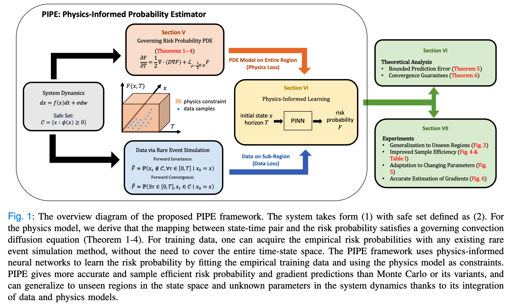

# PIPE: Physics-Informed Probability Estimator

An implementation of the paper "Generalizable Physics-Informed Learning for
Stochastic Safety-Critical Systems", in IEEE Transaction on Automatic Control (TAC). Short version at the 5th Learning for Decision and Control (L4DC) Conference, 2023.





## Citation

```biblitex
@article{wang2024generalizable,
  title={Generalizable Physics-Informed Learning for Stochastic Safety-Critical Systems},
  author={Wang, Zhuoyuan and Chern, Albert and Nakahira, Yorie},
  journal={arXiv preprint arXiv:2407.08868},
  year={2024}
}

@inproceedings{wang2023generalizable,
  title={A generalizable physics-informed learning framework for risk probability estimation},
  author={Wang, Zhuoyuan and Nakahira, Yorie},
  booktitle={Learning for Dynamics and Control Conference},
  pages={358--370},
  year={2023},
  organization={PMLR}
}
```


